# :pushpin: GOATrip WebProject
<br>

> 조원 : 심지연, 조영진


---

<br>

## ✒ 기획 배경

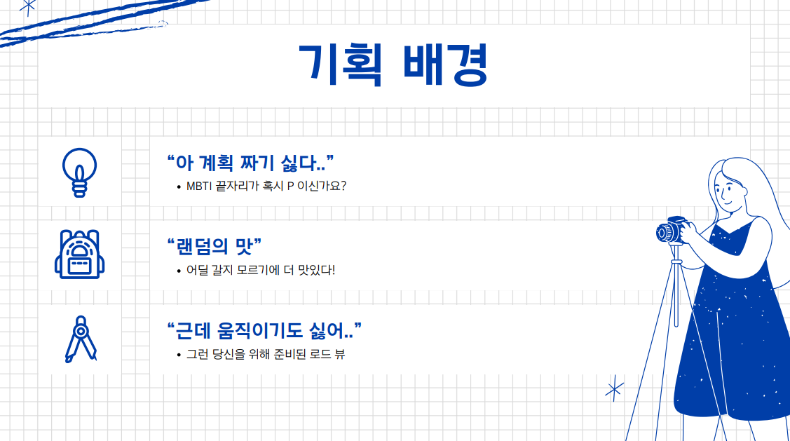
---

<br>

## 📅 개발 로드맵

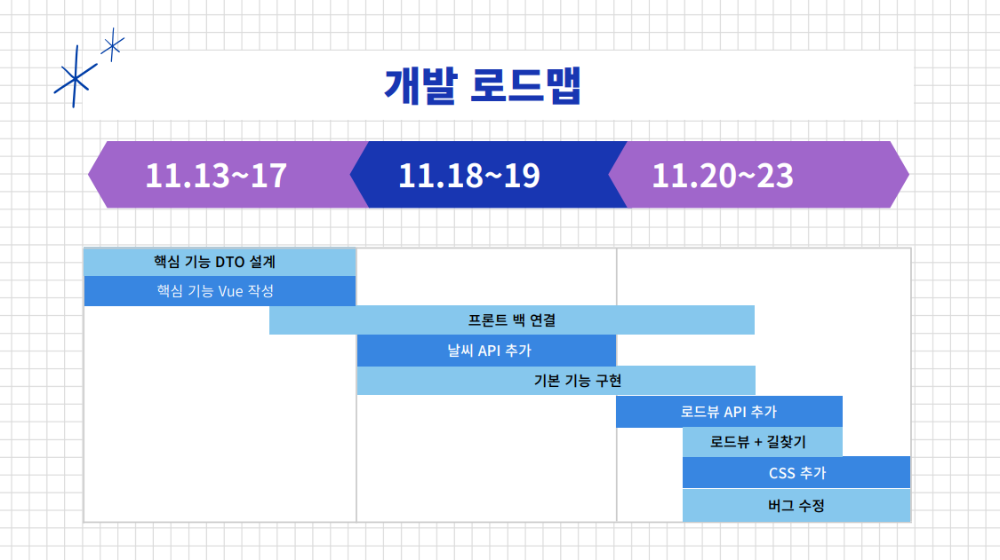

---

<br>

## ⚙ 개발 환경


---

<br>

## DIAGRAMS

#### ✔ UseCase Diagram

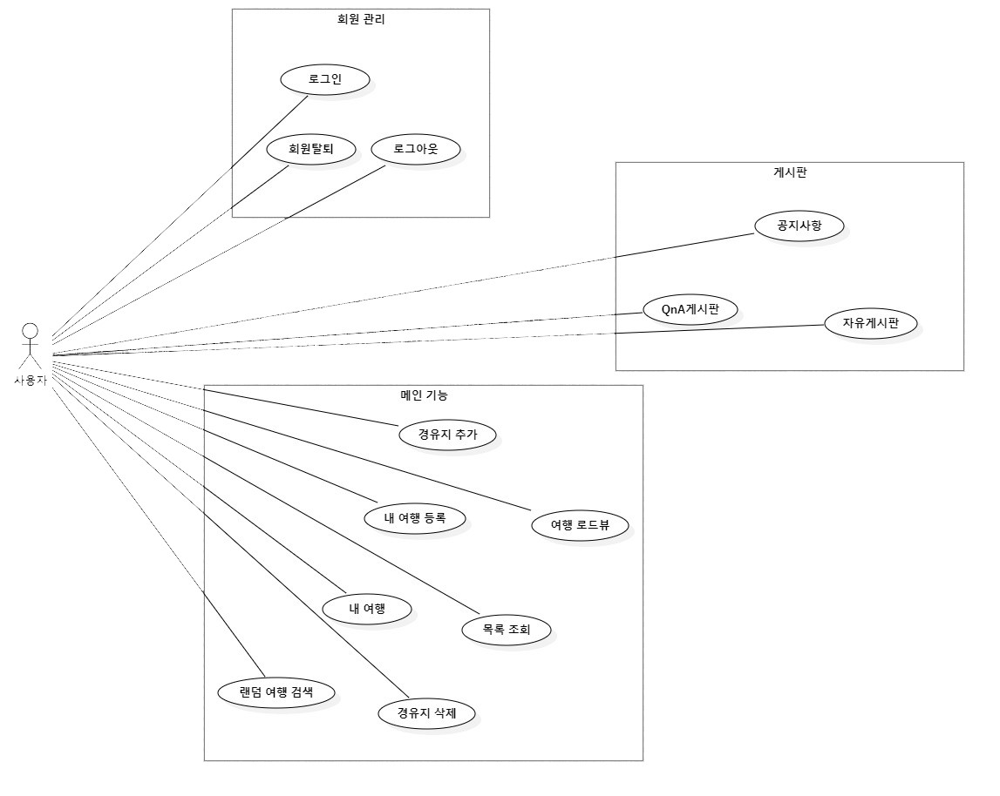
<br/>

---

<br>

#### ✔ Class Diagram

> 클릭하시면 자세하게 보실 수 있습니다.

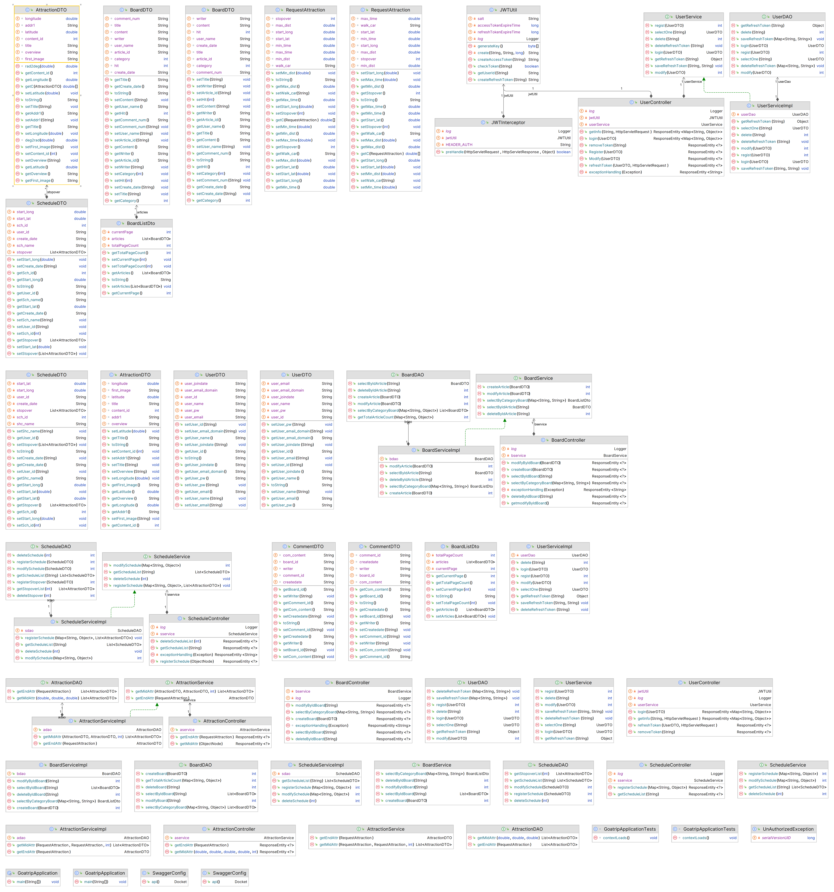
<br/>

---

<br>

#### ✔ ER Diagram

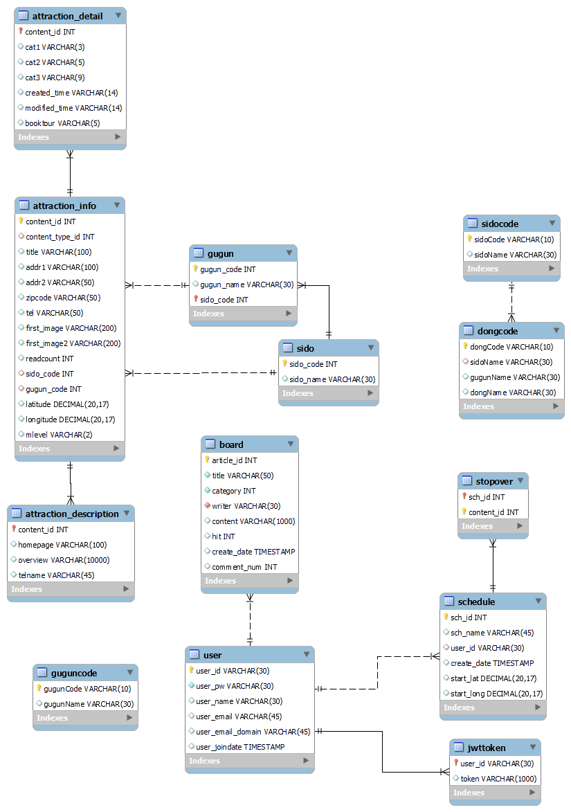

<br/>

---

<br>

## 사용화면

### 🔐 계정 관리 기능

#### ✔ LOGIN 화면
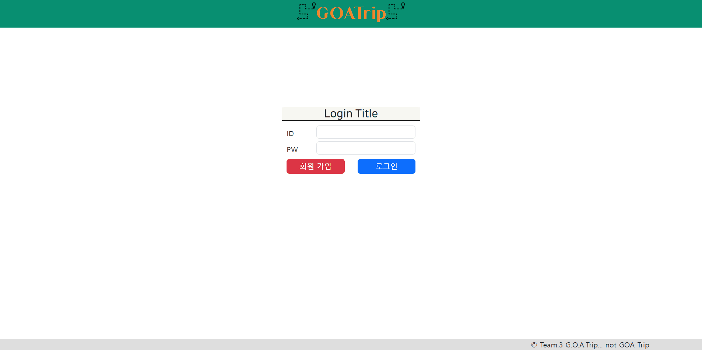

<br>

> #### UserController.java
> - JWT를 이용하여 구현하였으며, 로그인 시 DB에 일치하는 ID, PW가 있다면 토큰을 발급해준다.

```java
	@ApiOperation(value = "로그인", notes = "아이디와 비밀번호를 이용하여 로그인 처리.")
	@PostMapping("/login")
	public ResponseEntity<Map<String, Object>> login(@RequestBody UserDTO user) {
		System.out.println(user);
		log.debug("login user : {}", user);
		Map<String, Object> resultMap = new HashMap<String, Object>();
		HttpStatus status = HttpStatus.ACCEPTED;

		UserDTO loginUser;
		try {
			loginUser = userService.login(user);
			if (loginUser != null) {
				String accessToken = jwtUtil.createAccessToken(loginUser.getUser_id());
				String refreshToken = jwtUtil.createRefreshToken(loginUser.getUser_id());
				log.debug("access toekn : {}", accessToken);
				log.debug("refresh token :{}", refreshToken);

				// 발급받은 refresh token을 db에 저장.
				userService.saveRefreshToken(loginUser.getUser_id(), refreshToken);

				// json으로 token 전달.
				resultMap.put("access-token", accessToken);

				// cookie 변경
				resultMap.put("refresh-token", refreshToken);

				// 상태를 created로 바꿈
				status = HttpStatus.CREATED;
			} else {
				resultMap.put("msg", "아이디 또는 패스워드를 확인해주세요");
				status = HttpStatus.UNAUTHORIZED;
			}
		} catch (Exception e) {
			log.debug("로그인 에러 발생 : {}", e);
			resultMap.put("msg", e.getMessage());
			status = HttpStatus.INTERNAL_SERVER_ERROR;
		}
		return new ResponseEntity<Map<String, Object>>(resultMap, status);
	}

```

<br>

> #### member.js
> - 웹 서버에서는 발급받은 토큰을 Session에 등록하여 사용한다.

```javascript
export const useMemberStore = defineStore("memberStore", () => {
  const router = useRouter();

  const isLogin = ref(false);
  const isLoginError = ref(false);
  const userInfo = ref(null);
  const isValidToken = ref(false);

  const userLogin = async (loginUser) => {
    await userConfirm(
      loginUser,
      (response) => {
        if (response.status === httpStatusCode.CREATE) {
          let { data } = response;
          let accessToken = data["access-token"];
          let refreshToken = data["refresh-token"];
          isLogin.value = true;
          isLoginError.value = false;
          isValidToken.value = true;
          sessionStorage.setItem("accessToken", accessToken);
          sessionStorage.setItem("refreshToken", refreshToken);
        } else {
          console.log("로그인 실패했다");
          isLogin.value = false;
          isLoginError.value = true;
          isValidToken.value = false;
        }
      },
      (error) => {
        console.error(error);
      }
    );
  };
```

---

<br>

#### ✔ LOGOUT화면

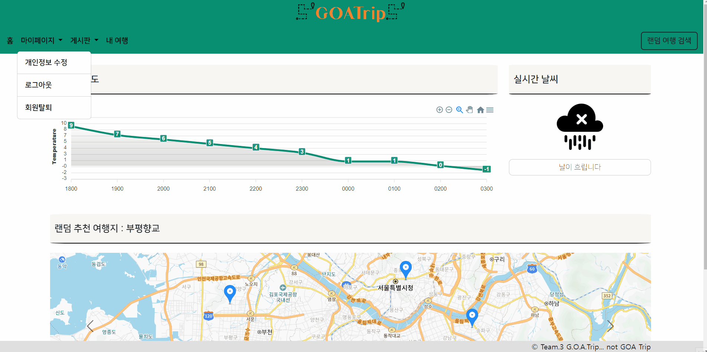

<br>

> #### Navigationbar.vue
> - 네비게이션 메뉴에서 로그아웃 버튼 클릭시 session에 있는 아이디를 디코드하여 member.js에 있는 userLogout의 인자로 넘겨준 뒤 세션에 저장된 토큰을 삭제해 준다.
 
```javascript
const onClickLogout = () => {
  let token = sessionStorage.getItem("accessToken");
  let decodeToken = jwtDecode(token);
  userLogout(decodeToken.user_id);

  sessionStorage.clear();

  router.push({
    path: "/",
  });
};
```

<br>

> #### member.js
> - 디코딩한 user_id가 DB에 있다면 로그인과 관련된 정보들을 초기화 해준다.

```javascript
  const userLogout = async (userid) => {
    await logout(
      userid,
      (response) => {
        if (response.status === httpStatusCode.OK) {
          isLogin.value = false;
          userInfo.value = null;
          isValidToken.value = false;
        } else {
          console.error("유저 정보 없음!!!!");
        }
      },
      (error) => {
        console.log(error);
      }
    );
  };
```

---

<br>

#### ✔ 회원정보 수정

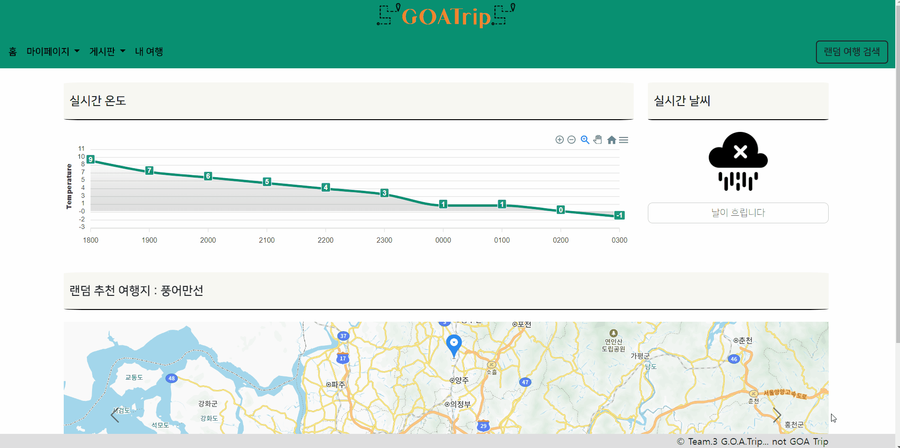
<br>

> #### Navigationbar.vue
> - 수정된 유저의 정보를 서버에 전달한다.
 
```javascript
const userModify = () => {
  console.log("변경합니다.");
  userChange(
    user.value,
    (response) => {
      let msg = "정보 수정 중 문제가 발생했습니다";
      if (response.status == 200) msg = "회원 정보 수정이 완료됐습니다.";
      alert(msg);
    },
    (error) => {
      console.error(error);
      alert("문제가 생겼다");
      router.go(0);
    }
  );
};
```

<br>

> #### UserController.java
> - 웹 서버에서 넘겨받은 유저 정보를 기반으로 해당 유저의 정보를 수정한다.

```java
	@ApiOperation(value = "회원정보 수정", notes = "비밀번호, 이름, 이메일을 수정.")
	@PostMapping("/modify")
	public ResponseEntity<?> Modify(@RequestBody UserDTO user) {
		HttpStatus status = HttpStatus.OK;
		String msg = "회원 정보 수정에 성공했습니다.";
		try {
			userService.modify(user);
			return new ResponseEntity<String>(msg, status);
		} catch (Exception e) {
			return exceptionHandling(e);
		}
	}
```

---

<br>

#### ✔ 회원가입


<br>

> - DB에 해당 정보를 넘긴 후, insert 시킨다.

---

<br>

### 📑게시판 기능

<br>

> - 대표적인 CRUD 기능은 User이랑 비슷하게 작동하기에 자세한 코드 설명은 생략토록 하겠다.
> - 다만 페이지네이션을 적용시켰으며, 공지사항의 경우에는 admin 계정 하나만 글을 작성 가능하게끔 하였다.

#### ✔ 게시판 조회

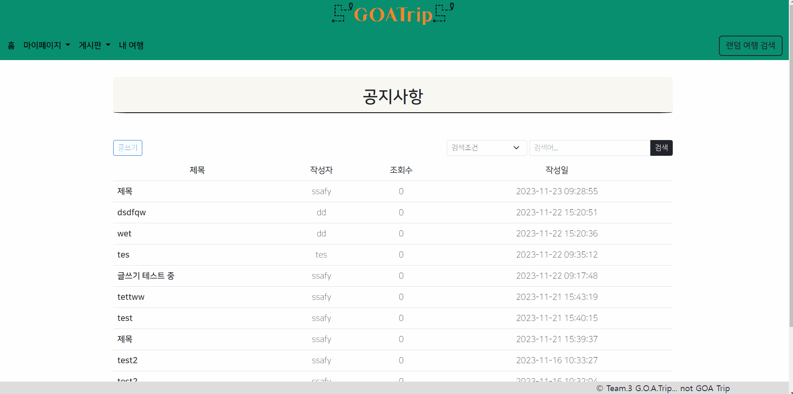

---

<br>

#### ✔ 글 등록

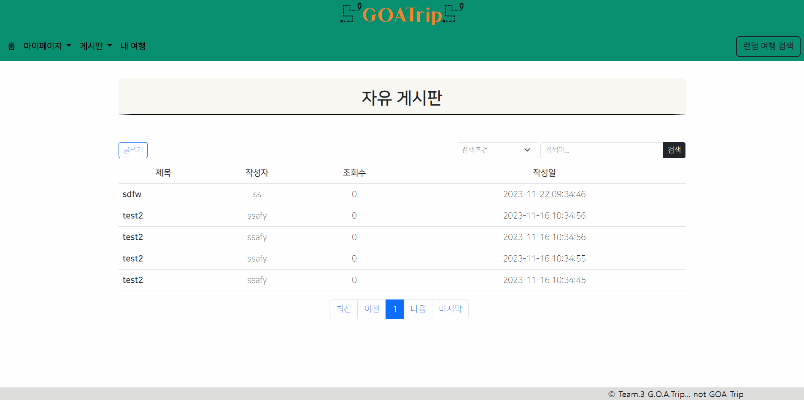
---

<br>

#### ✔ 글 삭제


---

<br>

#### ✔ 글 수정

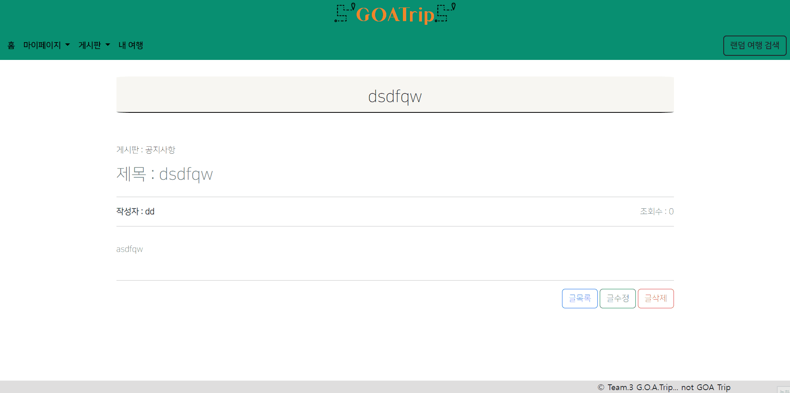

<br>

### ⛅ 실시간 날씨

#### ✔ 홈 화면
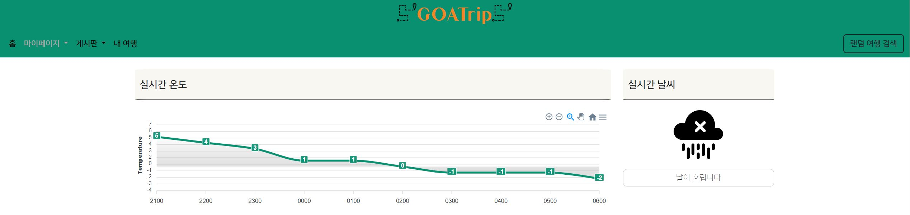

<br>

> #### MainpageView.vue
> - 기상청 API를 통해 날씨 데이터들을 전달받는다.
> - 데이터를 필요한 부분만 커팅하여 ApexChart.js를 이용하여 해당 데이터를 표로 나타내준다.

```javascript
// 날씨 리스트 가져오기
let filteredData;
let filteredDataSKY;
let filteredDataPTY;
const getListWeather = async (param) => {
  await listWheather(
    param,
    ({ data }) => {
      let dataArray = data.response.body.items.item;
      // console.log(dataArray);
      filteredData = filterDataByCategoryAndTime(dataArray, "TMP");
      filteredData = filteredData.splice(0, 10);
      // console.log(filteredData);

      filteredDataSKY = filterDataByCategoryAndTime(dataArray, "SKY");
      filteredDataSKY = filteredDataSKY.splice(0, 1);
      // console.log(filteredDataSKY);

      filteredDataPTY = filterDataByCategoryAndTime(dataArray, "PTY");
      filteredDataPTY = filteredDataPTY.splice(0, 1);
      // console.log(filteredDataPTY[0].fcstValue);
    },
    (err) => {
      console.log(err);
    }
  );
};

const filterDataByCategoryAndTime = (data, category) => {
  const filteredData = data.filter((item) => {
    return item.category === category;
  });
  return filteredData;
};
```

<br>

```javascript
<script setup>
import { ref } from "vue";
const { data } = defineProps(["data"]);

const chartOptions = ref({
  chart: {
    id: "weather-chart",
    type: "area",
  },
  xaxis: {
    categories: data.map((item) => item.fcstTime),
  },
  yaxis: {
    min: Math.min(...data.map((item) => item.fcstValue)) - 2,
    max: Math.max(...data.map((item) => item.fcstValue)) + 2,
    title: {
      text: "Temperature",
    },
  },
  dataLabels: {
    enabled: true,
    style: {
      colors: ["#089071"], // 숫자의 색상 설정
    },
  },
  stroke: {
    curve: "smooth",
    colors: ["#089071"],
  },
  fill: {
    type: "gradient", // 선 아래 영역을 gradient로 설정
    colors: ["#00000000"], // gradient의 색상 설정
    opacityFrom: 0.5,
    opacityTo: 0.2,
  },
});

const chartSeries = ref([
  {
    name: "Temperature",
    data: data.map((item) => item.fcstValue),
  },
]);
</script>

<template>
  <div>
    <apexchart
      :type="chartOptions.chart.type"
      :options="chartOptions"
      :series="chartSeries"
      height="200"
    />
  </div>
</template>

<style scoped></style>

```

<br>

> #### WheatherUtil.js
> - 기상청 API는 그리드 좌표를 사용하고 있으므로 변환해야하며, 0200시부터 3시간 간격으로 update되어 현재시간 기준 가장 빠른 업데이트 시간을 반환해주는 코드가 필요하다.

```javascript
//
// LCC DFS 좌표변환을 위한 기초 자료
//
var RE = 6371.00877; // 지구 반경(km)
var GRID = 5.0; // 격자 간격(km)
var SLAT1 = 30.0; // 투영 위도1(degree)
var SLAT2 = 60.0; // 투영 위도2(degree)
var OLON = 126.0; // 기준점 경도(degree)
var OLAT = 38.0; // 기준점 위도(degree)
var XO = 43; // 기준점 X좌표(GRID)
var YO = 136; // 기1준점 Y좌표(GRID)
//
// LCC DFS 좌표변환 ( code : "toXY"(위경도->좌표, v1:위도, v2:경도), "toLL"(좌표->위경도,v1:x, v2:y) )
//

function dfs_xy_conv(code, v1, v2) {
  var DEGRAD = Math.PI / 180.0;
  var RADDEG = 180.0 / Math.PI;

  var re = RE / GRID;
  var slat1 = SLAT1 * DEGRAD;
  var slat2 = SLAT2 * DEGRAD;
  var olon = OLON * DEGRAD;
  var olat = OLAT * DEGRAD;

  var sn = Math.tan(Math.PI * 0.25 + slat2 * 0.5) / Math.tan(Math.PI * 0.25 + slat1 * 0.5);
  sn = Math.log(Math.cos(slat1) / Math.cos(slat2)) / Math.log(sn);
  var sf = Math.tan(Math.PI * 0.25 + slat1 * 0.5);
  sf = (Math.pow(sf, sn) * Math.cos(slat1)) / sn;
  var ro = Math.tan(Math.PI * 0.25 + olat * 0.5);
  ro = (re * sf) / Math.pow(ro, sn);
  var rs = {};
  if (code == "toXY") {
    rs["lat"] = v1;
    rs["lng"] = v2;
    var ra = Math.tan(Math.PI * 0.25 + v1 * DEGRAD * 0.5);
    ra = (re * sf) / Math.pow(ra, sn);
    var theta = v2 * DEGRAD - olon;
    if (theta > Math.PI) theta -= 2.0 * Math.PI;
    if (theta < -Math.PI) theta += 2.0 * Math.PI;
    theta *= sn;
    rs["x"] = Math.floor(ra * Math.sin(theta) + XO + 0.5);
    rs["y"] = Math.floor(ro - ra * Math.cos(theta) + YO + 0.5);
  } else {
    rs["x"] = v1;
    rs["y"] = v2;
    var xn = v1 - XO;
    var yn = ro - v2 + YO;
    ra = Math.sqrt(xn * xn + yn * yn);
    if (sn < 0.0) -ra;
    var alat = Math.pow((re * sf) / ra, 1.0 / sn);
    alat = 2.0 * Math.atan(alat) - Math.PI * 0.5;

    if (Math.abs(xn) <= 0.0) {
      theta = 0.0;
    } else {
      if (Math.abs(yn) <= 0.0) {
        theta = Math.PI * 0.5;
        if (xn < 0.0) -theta;
      } else theta = Math.atan2(xn, yn);
    }
    var alon = theta / sn + olon;
    rs["lat"] = alat * RADDEG;
    rs["lng"] = alon * RADDEG;
  }
  return rs;
}

function getUnderboundTime() {
  const today = new Date();
  const currentHours = today.getHours();
  const currentMinutes = today.getMinutes();

  // 시간대 패턴 배열
  const timePatterns = [200, 500, 800, 1100, 1400, 1700, 2000, 2300];

  // 현재 시간 이전의 가장 빠른 시간대 찾기
  let underboundTimeIndex = 0;

  for (let i = 1; i < timePatterns.length; i++) {
    if (currentHours * 100 + currentMinutes < timePatterns[i]) {
      break; // 현재 시간 이전의 가장 빠른 시간대 찾음
    }
    underboundTimeIndex = i;
  }

  // 가장 가까운 언더바운드 시간대의 값을 객체로 반환
  const underboundTime = timePatterns[underboundTimeIndex].toString().padStart(4, "0");
  const underboundDate = `${today.getFullYear()}${(today.getMonth() + 1)
    .toString()
    .padStart(2, "0")}${today.getDate().toString().padStart(2, "0")}`;

  // console.log(underboundDate);
  // console.log(underboundTime);
  return {
    date: underboundDate,
    time: underboundTime,
  };
}

export { dfs_xy_conv, getUnderboundTime };
```

<br>

### 🗓 일정

#### ✔ 홈 화면 일정 등록


<br>

> #### VKakaoIterMap.vue
> - 사전에 설정된 parameter를 기반으로 추천된 여행 경로 3개를 kakaomap에 표시하고, 해당 지도를 캐러셀에 띄워준다.
> - 지도 클릭시 세부일정을 볼 수 있으며, 일정 등록을 통해서 해당 일정을 저장시킬 수 있다.
> - 데이터들은 시작점, 경유지, 도착지점의 데이터로 관리하며 이를 Json형태로 서버와 주고받는다. 
> - 아래의 코드는 상위 컴포넌트에서 데이터를 전달받아 여러개의 카카오 맵을 만들어주는 역할을 한다.

```javascript
<script setup>
import { ref, watch, onMounted } from "vue";

var map;

const positions = ref([]);
const markers = ref([]);

const props = defineProps({ points: Array, mapId: Number, slide: Boolean });

watch(
  () => props.slide,
  (newValue, oldValue) => {
    setInterval(() => {
      map.relayout();
      const bounds = positions.value.reduce(
        (bounds, position) => bounds.extend(position.latlng),
        new kakao.maps.LatLngBounds()
      );
      map.setBounds(bounds);
    }, 100);
  }
);

watch(
  () => props.points,
  (newValue, oldValue) => {
    console.log("뉴발>>", newValue);
    deleteMarkers();
    initMap();
  }
);

onMounted(() => {
  if (window.kakao && window.kakao.maps) {
    initMap();
  } else {
    const script = document.createElement("script");
    script.src = `//dapi.kakao.com/v2/maps/sdk.js?autoload=false&appkey=${
      import.meta.env.VITE_KAKAO_MAP_SERVICE_KEY
    }&libraries=services,clusterer`;
    /* global kakao */
    script.onload = () => kakao.maps.load(() => initMap());
    document.head.appendChild(script);
  }
});

const initMap = () => {
  const container = document.getElementById(props.mapId);
  const options = {
    center: new kakao.maps.LatLng(33.450701, 126.570667),
    level: 3,
  };
  map = new kakao.maps.Map(container, options);
  map.setDraggable(false);
  map.setZoomable(false);

  // console.log("call");
  loadMarkers();
};

const loadMarkers = () => {
  // 현재 표시되어있는 marker들이 있다면 map에 등록된 marker를 제거한다.

  deleteMarkers();

  // 마커 이미지를 생성합니다
  //   const imgSrc = require("@/assets/map/markerStar.png");
  // 마커 이미지의 이미지 크기 입니다
  //   const imgSize = new kakao.maps.Size(24, 35);
  //   const markerImage = new kakao.maps.MarkerImage(imgSrc, imgSize);

  // 마커를 생성합니다

  positions.value = [];
  props.points.forEach((item) => {
    let obj = {};
    obj.latlng = new kakao.maps.LatLng(item.latitude, item.longitude);
    obj.title = item.title;

    // console.log(obj);

    positions.value.push(obj);
  });

  markers.value = [];
  positions.value.forEach((position) => {
    const marker = new kakao.maps.Marker({
      map: map, // 마커를 표시할 지도
      position: position.latlng, // 마커를 표시할 위치
      title: position.title, // 마커의 타이틀, 마커에 마우스를 올리면 타이틀이 표시됨.
      clickable: true, // // 마커를 클릭했을 때 지도의 클릭 이벤트가 발생하지 않도록 설정합니다
      // image: markerImage, // 마커의 이미지
    });
    markers.value.push(marker);
  });

  // 4. 지도를 이동시켜주기
  // 배열.reduce( (누적값, 현재값, 인덱스, 요소)=>{ return 결과값}, 초기값);
  const bounds = positions.value.reduce(
    (bounds, position) => bounds.extend(position.latlng),
    new kakao.maps.LatLngBounds()
  );
  map.setBounds(bounds);
};

const deleteMarkers = () => {
  if (markers.value.length > 0) {
    markers.value.forEach((marker) => marker.setMap(null));
  }
};
</script>

<template>
  <div :id="mapId" style="width: 100%; height: 400px"></div>
</template>

<style></style>

```

<br>

> #### ScheduleController.java
> - 서버는 웹서버에서 전달받은 데이터를 DB에 저장한다.

```java
	@PostMapping("/register")
	public ResponseEntity<?> registerSchedule(@RequestBody ObjectNode obj)
			throws JsonMappingException, JsonProcessingException {

		ObjectMapper mapper = new ObjectMapper();
		Map<String, Object> map = new HashMap<String, Object>();
		String sch_name = obj.get("sch_name").toString().substring(1, obj.get("sch_name").toString().length() - 1);
		map.put("sch_name", sch_name);
		String user_id = obj.get("user_id").toString().substring(1, obj.get("user_id").toString().length() - 1);
		map.put("user_id", user_id);
		map.put("start_lat", obj.get("start_lat").asDouble());
		map.put("start_long", obj.get("start_long").asDouble());
		String jsonStr = obj.get("stopover").toString();

		// stopover를 array로 받아서 처리한다.
		ArrayNode array = (ArrayNode) mapper.readTree(jsonStr);
		List<AttractionDTO> attr_list = new LinkedList<AttractionDTO>();
		if (array.isArray()) {
			for (JsonNode jsonNode : array) {
				AttractionDTO attr = mapper.treeToValue(jsonNode, AttractionDTO.class);
				attr_list.add(attr);
			}
		}
//		System.out.println("여기 리스트 전체 "+attr_list);
//		map.put("stopover", attr_list);

		String msg = "일정 등록에 성공했습니다.";
		System.out.println(map);
		int result = 0;
		System.out.println("map : " + map);
		System.out.println("list : " + attr_list);
		try {
			sservice.registerSchedule(map, attr_list);
			return new ResponseEntity<String>(msg, HttpStatus.OK);
		} catch (SQLException e) {
			return exceptionHandling(e);
		}
	}
```

---

<br>

#### ✔ 랜덤 일정 검색


<br>

> #### AttractionController.java
> - 랜덤 여행 검색은 geolocation API를 통해 얻어낸 본인의 위치와 입렵된 거리를 이용하여 일단 목적지를 설정한다.
> - 경유지는 본인의 위치와 목적지 사이의 가상의 원을 그리고 그 안에있는 경유지를 반환해준다.
> - 입력받은 경유지 수 만큼 반복하여 경유지의 정보가 담긴 List를 반환해준다

```java
@Controller
@RequestMapping("/trip")
@CrossOrigin("*")
public class AttractionController {
	@Autowired
	public AttractionService aservice;

	@PostMapping("/getend")
	public ResponseEntity<?> getEndAttr(@RequestBody RequestAttraction radto) throws SQLException {
//		System.out.println("여기옴??");
		System.out.println(radto);
		// 시간 * 이동방식 디폴드 값
		double mint = radto.getMin_time();
		double maxt = radto.getMax_time();
		if (radto.getWalk_car().equals("car")) {
			radto.setMin_dist(mint * 40000);
			radto.setMax_dist(maxt * 40000);
		} else if (radto.getWalk_car().equals("walk")) {
			radto.setMin_dist(mint * 2000);
			radto.setMax_dist(maxt * 2000);
		}
		System.out.println(radto);

		AttractionDTO result = aservice.getEndAttr(radto);
		System.out.println("도착 지점 : " + result);
		return new ResponseEntity<AttractionDTO>(result, HttpStatus.OK);
	}

	@PostMapping("/getstopover")
	public ResponseEntity<?> getMidAttr(@RequestBody ObjectNode obj)
			throws SQLException, JsonProcessingException, IllegalArgumentException {
		ObjectMapper mapper = new ObjectMapper();

		AttractionDTO startdto = mapper.treeToValue(obj.get("startPoint"), AttractionDTO.class);

		AttractionDTO enddto = mapper.treeToValue(obj.get("endPoint"), AttractionDTO.class);

		int stopover = obj.get("stopoverNum").asInt();
		System.out.println("시작 지점 : " + startdto);
		System.out.println("도착 지점 : " + enddto);
		List<AttractionDTO> result = aservice.getMidAttr(startdto, enddto, stopover);
		System.out.println("경유지 : " + result);
		return new ResponseEntity<List>(result, HttpStatus.OK);
	}

}
```

---

<br>

#### ✔ 랜덤 일정 등록


<br>

> 일정 등록은 홈에서 일정 등록 했던 것과 동일하게 동작한다.
---

<br>

#### ✔ 등록된 일정보기 


<br>

> #### VKakaoMapRoadView.vue
> - 서버에서는 사용자가 저장했던 스케쥴 List로 반환해준다.
> - 웹 서버에서는 이를 받아, 4개의 카드를 사용자에게 보여준다.
> - 카드 클릭시 본인이 저장했던 경유지가 리스트로 보여준다.
> - 추가로 Kakao Mobility API를 이용하여 시작점 - 경유지 - 도착지점의 추천 경로를 맵에 띄워주고, 옆에는 해당 경로를 따라갈 수 있게끔 로드맵 뷰를 띄워주었다.

```javascript
<script setup>
import { ref, watch, onMounted } from "vue";
import { getMoblilty } from "../../api/mobility";

var map;

const positions = ref([]);
const markers = ref([]);
var line;

const props = defineProps({
  sampleData: Array,
});

let result = {};
onMounted(() => {
  // 시작 지점, 끝 지점 추출
  const origin = { x: props.sampleData[0].longitude, y: props.sampleData[0].latitude };
  const destination = {
    x: props.sampleData[props.sampleData.length - 1].longitude,
    y: props.sampleData[props.sampleData.length - 1].latitude,
  };

  // 중간 지점들을 데이터 개수 - 2개로 선택
  const waypoints = [];
  for (let i = 1; i < props.sampleData.length - 1; i++) {
    waypoints.push({
      name: props.sampleData[i].title,
      x: props.sampleData[i].longitude,
      y: props.sampleData[i].latitude,
    });
  }

  // 결과 형식으로 변환
  result = {
    origin,
    destination,
    waypoints,
    priority: "RECOMMEND",
    car_fuel: "GASOLINE",
    car_hipass: false,
    alternatives: false,
    road_details: false,
  };

  getMobliltyList(result);

  if (window.kakao && window.kakao.maps) {
    initMap();
  } else {
    const script = document.createElement("script");
    script.src = `//dapi.kakao.com/v2/maps/sdk.js?autoload=false&appkey=${
      import.meta.env.VITE_KAKAO_MAP_SERVICE_KEY
    }&libraries=services,clusterer`;
    /* global kakao */
    script.onload = () => kakao.maps.load(() => initMap());
    document.head.appendChild(script);
  }
});

let extractedData = [];
const getMobliltyList = async (param) => {
  console.log("Mobility param>>>", param);
  await getMoblilty(
    param,
    (resp) => {
      console.log("Mobility resp>>>>", resp.data);

      resp.data.routes.forEach((route) => {
        route.sections.forEach((section) => {
          section.roads.forEach((road) => {
            road.vertexes.forEach(
              (vertex, index) => {
                // 추출된 데이터 배열에 추가
                if (index % 2 === 0) {
                  extractedData.push([road.vertexes[index + 1], road.vertexes[index]]);
                }
              }
            );
          });
        });
      });

      console.log("정렬된 데이터 >>", extractedData);
      drawLine(extractedData);
    },
    (error) => {
      console.log(error);
    }
  );
};

watch(
  () => props.sampleData,
  () => {
    loadMarkers();
  }
);

const initMap = () => {
  const container = document.getElementById("map");
  const options = {
    center: new kakao.maps.LatLng(33.450701, 126.570667),
    level: 3,
  };
  map = new kakao.maps.Map(container, options);

  // 로드뷰 도로를 지도위에 올린다.
  map.addOverlayMapTypeId(kakao.maps.MapTypeId.ROADVIEW);

  var roadviewContainer = document.getElementById("roadview"); // 로드뷰를 표시할 div
  var roadview = new kakao.maps.Roadview(roadviewContainer); // 로드뷰 객체
  var roadviewClient = new kakao.maps.RoadviewClient(); // 좌표로부터 로드뷰 파노ID를 가져올 로드뷰 helper객
  // console.log("call");

  var mapCenter = new kakao.maps.LatLng(
    37.510701,
    127.098557
    // props.sampleData[0].latitude,
    // props.sampleData[0].longitude
  );
  roadviewClient.getNearestPanoId(mapCenter, 150, function (panoId) {
    roadview.setPanoId(panoId, mapCenter); // panoId와 중심좌표를 통해 로드뷰 실행
  });

  var mapWalker = null;

  kakao.maps.event.addListener(roadview, "init", function () {
    // map walker를 생성한다. 생성시 지도의 중심좌표를 넘긴다.
    mapWalker = new MapWalker(mapCenter);
    mapWalker.setMap(map); // map walker를 지도에 설정한다.

    // 로드뷰가 초기화 된 후, 추가 이벤트를 등록한다.
    // 로드뷰를 상,하,좌,우,줌인,줌아웃을 할 경우 발생한다.
    // 로드뷰를 조작할때 발생하는 값을 받아 map walker의 상태를 변경해 준다.
    kakao.maps.event.addListener(roadview, "viewpoint_changed", function () {
      // 이벤트가 발생할 때마다 로드뷰의 viewpoint값을 읽어, map walker에 반영
      var viewpoint = roadview.getViewpoint();
      mapWalker.setAngle(viewpoint.pan);
    });

    // 로드뷰내의 화살표나 점프를 하였을 경우 발생한다.
    // position값이 바뀔 때마다 map walker의 상태를 변경해 준다.
    kakao.maps.event.addListener(roadview, "position_changed", function () {
      // 이벤트가 발생할 때마다 로드뷰의 position값을 읽어, map walker에 반영
      var position = roadview.getPosition();
      mapWalker.setPosition(position);
      map.setCenter(position);
    });
  });
  loadMarkers();
};

const loadMarkers = () => {
  // 현재 표시되어있는 marker들이 있다면 map에 등록된 marker를 제거한다.

  deleteMarkers();

  // 마커를 생성합니다

  positions.value = [];
  props.sampleData.forEach((item) => {
    let obj = {};
    obj.latlng = new kakao.maps.LatLng(item.latitude, item.longitude);
    obj.title = item.title;

    // console.log(obj);
    positions.value.push(obj);
  });

  markers.value = [];
  positions.value.forEach((position) => {
    const marker = new kakao.maps.Marker({
      map: map, // 마커를 표시할 지도
      position: position.latlng, // 마커를 표시할 위치
      title: position.title, // 마커의 타이틀, 마커에 마우스를 올리면 타이틀이 표시됨.
      clickable: true, // // 마커를 클릭했을 때 지도의 클릭 이벤트가 발생하지 않도록 설정합니다
      // image: markerImage, // 마커의 이미지
    });
    markers.value.push(marker);
  });

  // 4. 지도를 이동시켜주기
  // 배열.reduce( (누적값, 현재값, 인덱스, 요소)=>{ return 결과값}, 초기값);
  const bounds = positions.value.reduce(
    (bounds, position) => bounds.extend(position.latlng),
    new kakao.maps.LatLngBounds()
  );

  map.setBounds(bounds);
  //drawLine();
};

const deleteMarkers = () => {
  if (markers.value.length > 0) {
    markers.value.forEach((marker) => marker.setMap(null));
  }
};

const drawLine = (extractedData) => {
  if (line) {
    line.setMap(null);
  }

  console.log(extractedData, "ext");
  const positions = extractedData.map(
    (position) => new kakao.maps.LatLng(position[0], position[1])
    //(pos) => console.log(pos, "pos")
  );

  line = new kakao.maps.Polyline({
    path: positions,
    strokeWeight: 3,
    strokeColor: "#000000",
    strokeOpacity: 0.7,
    strokeStyle: "solid",
  });

  line.setMap(map);
};

function MapWalker(position) {
  //커스텀 오버레이에 사용할 map walker 엘리먼트
  var content = document.createElement("div");
  var figure = document.createElement("div");
  var angleBack = document.createElement("div");

  //map walker를 구성하는 각 노드들의 class명을 지정 - style셋팅을 위해 필요
  content.className = "MapWalker";
  figure.className = "figure";
  angleBack.className = "angleBack";

  content.appendChild(angleBack);
  content.appendChild(figure);

  //커스텀 오버레이 객체를 사용하여, map walker 아이콘을 생성
  var walker = new kakao.maps.CustomOverlay({
    position: position,
    content: content,
    yAnchor: 1,
  });

  this.walker = walker;
  this.content = content;
}

//로드뷰의 pan(좌우 각도)값에 따라 map walker의 백그라운드 이미지를 변경 시키는 함수
//background로 사용할 sprite 이미지에 따라 계산 식은 달라 질 수 있음
MapWalker.prototype.setAngle = function (angle) {
  var threshold = 22.5; //이미지가 변화되어야 되는(각도가 변해야되는) 임계 값
  for (var i = 0; i < 16; i++) {
    //각도에 따라 변화되는 앵글 이미지의 수가 16개
    if (angle > threshold * i && angle < threshold * (i + 1)) {
      //각도(pan)에 따라 아이콘의 class명을 변경
      var className = "m" + i;
      this.content.className = this.content.className.split(" ")[0];
      this.content.className += " " + className;
      break;
    }
  }
};

//map walker의 위치를 변경시키는 함수
MapWalker.prototype.setPosition = function (position) {
  this.walker.setPosition(position);
};

//map walker를 지도위에 올리는 함수
MapWalker.prototype.setMap = function (map) {
  this.walker.setMap(map);
};
</script>

<template>
  <div id="mapWrapper" style="width: 59%; height: 300px; float: left">
    <div id="map" style="width: 100%; height: 100%"></div>
  </div>

  <div id="rvWrapper" style="width: 40%; height: 300px; float: left">
    <div id="roadview" style="width: 100%; height: 100%"></div>
  </div>
</template>
```


